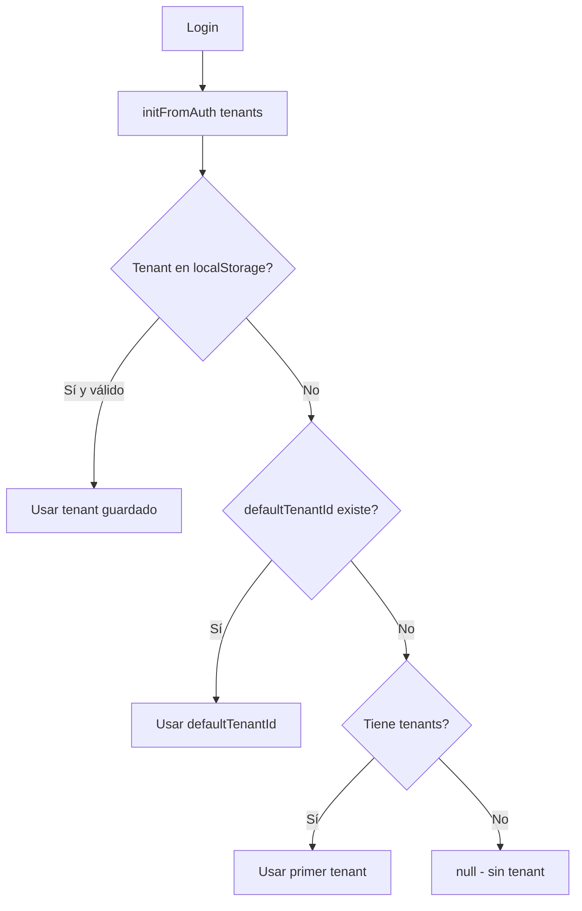
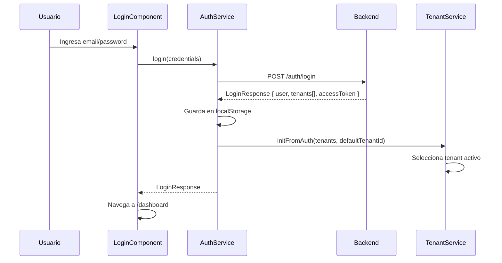
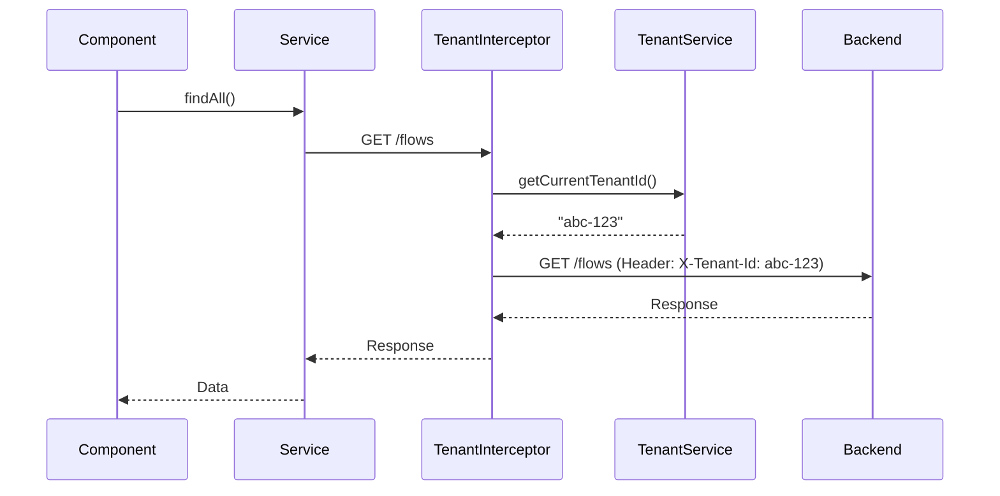
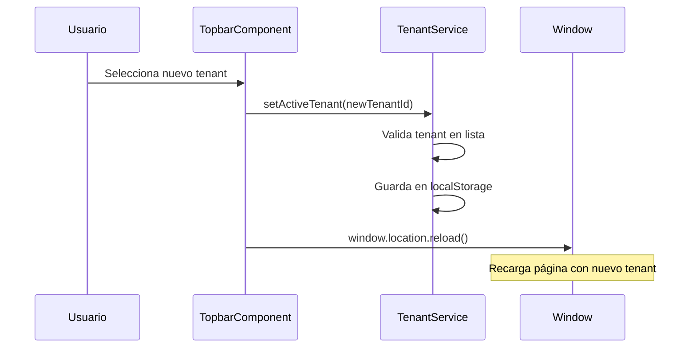

# Arquitectura Multi-Tenant Frontend - Angular 19

## 📋 Resumen

Este documento describe la arquitectura multi-tenant implementada en el frontend Angular 19, que permite:

1. **Un usuario puede tener N tenants asignados**
2. **El usuario selecciona el tenant activo** desde el frontend
3. **El frontend envía `X-Tenant-Id`** automáticamente en las requests tenant-scoped
4. **SuperAdmins pueden**:
   - Ver pantallas globales sin tenant
   - Seleccionar un tenant para operar dentro de él
5. **Endpoints globales** se llaman sin `X-Tenant-Id`

---

## 🎯 Problema que Resuelve

### Antes del Refactor (Modelo Antiguo):
- Un usuario tenía **un solo `tenantId`** fijo
- No se podía cambiar de tenant sin logout/login
- Los servicios recibían `tenantId` como parámetro manual
- No había distinción clara entre endpoints globales y tenant-scoped

### Después del Refactor (Modelo Multi-Tenant):
- Un usuario tiene **N tenants** con roles específicos
- El usuario **elige el tenant activo** desde un selector en el UI
- Los servicios **NO reciben `tenantId` manual**, el interceptor lo agrega automáticamente
- Clara separación entre endpoints globales y tenant-scoped

---

## 🏗️ Componentes del Sistema Multi-Tenant

### 1. Modelos de Autenticación (`auth.model.ts`)

#### `AuthUserTenant`
Representa un tenant asignado al usuario con su rol:

```typescript
export interface AuthUserTenant {
  id: string;        // ID del tenant
  name: string;      // Nombre del tenant
  role: string;      // Rol del usuario en ese tenant (admin, member, etc.)
}
```

#### `LoginResponse`
Respuesta del backend después del login:

```typescript
export interface LoginResponse {
  accessToken: string;
  tokenType: string;
  expiresIn: number;
  user: AuthUser;
  tenants: AuthUserTenant[];  // ⭐ Lista de tenants del usuario
  refreshToken?: string;
}
```

#### `AuthUser`
Usuario autenticado:

```typescript
export interface AuthUser {
  id: string;
  email: string;
  fullName: string;
  defaultTenantId?: string | null;  // ⭐ Tenant por defecto (opcional)
  isSuperAdmin?: boolean;
  isActive: boolean;
  avatarUrl?: string;
  roles?: string[];
  permissions?: string[];
}
```

**Cambios clave:**
- ❌ `tenantId` (antes: string | null)
- ✅ `defaultTenantId` (ahora: string | null | undefined)
- ✅ La lista de tenants viene separada en `LoginResponse.tenants`

---

### 2. TenantService (`tenant.service.ts`)

Servicio central para gestionar el contexto multi-tenant.

#### Responsabilidades:

1. **Almacenar lista de tenants del usuario**
2. **Gestionar el tenant activo** (el que se usa para `X-Tenant-Id`)
3. **Persistir selección** en localStorage
4. **Validar** que el tenant seleccionado esté en la lista del usuario

#### API Pública:

```typescript
// Inicializar después del login
initFromAuth(tenants: AuthUserTenant[], defaultTenantId?: string | null): void

// Cambiar tenant activo
setActiveTenant(tenantId: string | null, persist = true): void

// Obtener tenant activo (ID)
getCurrentTenantId(): string | null

// Obtener lista de tenants del usuario
getUserTenants(): AuthUserTenant[]

// Obtener tenant activo completo (con nombre y rol)
getActiveTenant(): AuthUserTenant | null

// Verificar si hay tenant seleccionado
hasTenant(): boolean

// Limpiar todo (logout)
clearCurrentTenantId(): void
```

#### Flujo de Selección de Tenant:



---

### 3. TenantInterceptor (`tenant.interceptor.ts`)

Interceptor HTTP que agrega el header `X-Tenant-Id` a las requests.

#### Lógica de Exclusión:

```typescript
const globalEndpoints = [
  '/auth/login',
  '/auth/register',
  '/auth/refresh',
  '/auth/me',
  '/auth/my-tenants',
  '/auth/logout',
  '/auth/forgot-password',
  '/auth/reset-password',
  '/auth/verify-email',
  '/auth/change-password',
];

// Si el endpoint es global → NO agregar header
// Si no hay tenant activo → NO agregar header
// Si es tenant-scoped Y hay tenant → Agregar header X-Tenant-Id
```

#### Ejemplo:

```
GET /flows              → Header: X-Tenant-Id: abc-123
POST /auth/login        → Sin header (endpoint global)
GET /auth/me            → Sin header (endpoint global)
GET /knowledge/articles → Header: X-Tenant-Id: abc-123
```

---

### 4. TenantRequiredGuard (`tenant-required.guard.ts`)

Guard para proteger rutas que **requieren** un tenant activo.

#### Comportamiento:

- ✅ **Si hay tenant activo** → Permite acceso
- ❌ **Si NO hay tenant activo** → Redirige a `/select-tenant`

#### Uso:

```typescript
// En app.routes.ts
{
  path: 'flows',
  loadChildren: () => import('./contexts/flows/flows.routes').then((m) => m.FLOWS_ROUTES),
  canActivate: [tenantRequiredGuard],  // ⭐ Guard aplicado
}
```

#### Rutas Protegidas (Tenant-Scoped):

- ✅ `channels`
- ✅ `conversations`
- ✅ `destinations`
- ✅ `flows`
- ✅ `knowledge`
- ✅ `rag`
- ✅ `catalog`
- ✅ `llm-usage`

#### Rutas Globales (Sin Guard):

- ❌ `auth` (login, registro, etc.)
- ❌ `dashboard` (puede mostrar info global)
- ❌ `tenants` (gestión global para superadmin)
- ❌ `users`, `teams`, `roles`, `permissions` (gestión global)

---

### 5. AuthService (`auth.service.ts`)

#### Cambios en `setAuthData()`:

```typescript
private setAuthData(response: LoginResponse): void {
  // Guardar tokens y usuario
  localStorage.setItem('access_token', response.accessToken);
  localStorage.setItem('user', JSON.stringify(response.user));

  // ⭐ NUEVO: Guardar lista de tenants
  localStorage.setItem('tenants', JSON.stringify(response.tenants || []));

  // ⭐ NUEVO: Inicializar TenantService con lista de tenants
  this.tenantService.initFromAuth(
    response.tenants || [],
    response.user.defaultTenantId
  );
}
```

#### Cambios en `loadUserFromStorage()`:

```typescript
private loadUserFromStorage(): void {
  const user = JSON.parse(localStorage.getItem('user'));
  const tenants = JSON.parse(localStorage.getItem('tenants') || '[]');

  // ⭐ NUEVO: Restaurar contexto de tenants
  this.tenantService.initFromAuth(tenants, user.defaultTenantId);
}
```

---

### 6. TopbarComponent (Selector de Tenant)

Componente del header que muestra el selector de tenant.

#### Características:

- **Muestra lista de tenants del usuario** (no todos los tenants del sistema)
- **Visible para todos los usuarios** (no solo superadmins)
- **Se oculta automáticamente** si el usuario tiene solo 1 tenant
- **Muestra el rol del usuario** en cada tenant

#### Lógica de Visibilidad:

```typescript
get showTenantSelector(): boolean {
  return this.userTenants.length > 1 || this.isSuperAdmin;
}
```

#### UI del Selector:

```html
<p-select
  [options]="userTenants"
  [(ngModel)]="selectedTenantId"
  optionLabel="name"
  optionValue="id"
  (onChange)="onTenantChange($event)"
>
  <ng-template let-tenant pTemplate="item">
    <div class="tenant-item">
      <i class="pi pi-building"></i>
      <span>{{ tenant.name }}</span>
      <span class="tenant-role">({{ tenant.role }})</span>
    </div>
  </ng-template>
</p-select>
```

---

### 7. SelectTenantComponent (Página de Selección)

Página que se muestra cuando:
- El usuario intenta acceder a una ruta tenant-scoped sin tenant activo
- El usuario no tiene ningún tenant asignado

#### Casos de Uso:

1. **Usuario con múltiples tenants** → Muestra grid de tarjetas para seleccionar
2. **Usuario sin tenants** → Muestra mensaje de error y botón de logout

#### Ruta:
```
/select-tenant
```

---

## 🔄 Flujo Completo de Autenticación Multi-Tenant

### 1. Login



### 2. Request Tenant-Scoped



### 3. Cambio de Tenant



---

## 📦 Refactorización de Servicios

### Antes del Refactor:

```typescript
// ❌ Servicios recibían tenantId manual
export class FlowsService {
  findAll(tenantId: string): Observable<Flow[]> {
    return this.http.get<Flow[]>(`/flows?tenantId=${tenantId}`);
  }
}

// ❌ Componentes debían pasar tenantId
this.flowsService.findAll(this.currentTenantId).subscribe(...);
```

### Después del Refactor:

```typescript
// ✅ Servicios NO reciben tenantId
export class FlowsService {
  findAll(): Observable<Flow[]> {
    // El interceptor agregará X-Tenant-Id automáticamente
    return this.http.get<Flow[]>('/flows');
  }
}

// ✅ Componentes NO se preocupan por tenant
this.flowsService.findAll().subscribe(...);
```

**Beneficios:**
- ✅ Código más limpio
- ✅ Menos acoplamiento
- ✅ Cambio de tenant transparente
- ✅ Menos errores humanos

---

## 🚀 Migración Progresiva

### Paso 1: Actualizar Modelos
```bash
# Ya implementado en auth.model.ts
```

### Paso 2: Actualizar TenantService
```bash
# Ya implementado en tenant.service.ts
```

### Paso 3: Actualizar TenantInterceptor
```bash
# Ya implementado en tenant.interceptor.ts
```

### Paso 4: Aplicar Guards
```bash
# Ya implementado en app.routes.ts
```

### Paso 5: Refactorizar Servicios (Uno por Uno)

Para cada servicio en `contexts/*/services/*.service.ts`:

1. **Eliminar parámetros `tenantId`** de los métodos
2. **Confiar en el interceptor** para agregar `X-Tenant-Id`
3. **Probar** que las llamadas HTTP funcionen correctamente

**Ejemplo:**

```typescript
// ANTES
findAll(tenantId: string, filters?: any): Observable<Flow[]> {
  return this.http.get<Flow[]>(`/flows`, {
    params: { tenantId, ...filters }
  });
}

// DESPUÉS
findAll(filters?: any): Observable<Flow[]> {
  // El interceptor agregará X-Tenant-Id como header
  return this.http.get<Flow[]>('/flows', {
    params: filters
  });
}
```

---

## 🔧 Casos de Uso Especiales

### SuperAdmin sin Tenants

Un superadmin puede no tener tenants asignados pero necesita ver pantallas globales:

```typescript
// En dashboard, mostrar info global si no hay tenant
get showGlobalDashboard(): boolean {
  return this.isSuperAdmin && !this.tenantService.hasTenant();
}
```

### Usuario con 1 Solo Tenant

El selector de tenant se oculta automáticamente:

```typescript
get showTenantSelector(): boolean {
  return this.userTenants.length > 1 || this.isSuperAdmin;
}
```

### Cambio de Tenant en Tiempo Real

Al cambiar de tenant, se recarga la página para refrescar todos los datos:

```typescript
onTenantChange(event: any): void {
  this.tenantService.setActiveTenant(event.value);
  window.location.reload();  // Recarga limpia
}
```

**Alternativa Avanzada (sin reload):**
- Usar un `BehaviorSubject` para `activeTenant$`
- Que todos los componentes se suscriban
- Recargar datos automáticamente al cambiar

---

## 🎨 UX Recomendaciones

### 1. Indicador Visual de Tenant Activo
```html
<div class="current-tenant-badge">
  <i class="pi pi-building"></i>
  <span>{{ currentTenantName }}</span>
</div>
```

### 2. Confirmación al Cambiar Tenant
```typescript
onTenantChange(event: any): void {
  this.confirmationService.confirm({
    message: '¿Cambiar de tenant? Los datos se recargarán.',
    accept: () => {
      this.tenantService.setActiveTenant(event.value);
      window.location.reload();
    }
  });
}
```

### 3. Breadcrumbs con Tenant
```html
<p-breadcrumb [model]="breadcrumbItems"></p-breadcrumb>
<!-- Ejemplo: Home > [TenantA] > Flows > Flow Detail -->
```

---

## 🐛 Troubleshooting

### Problema: No se agrega X-Tenant-Id

**Causa:** El endpoint está en la lista de `globalEndpoints`

**Solución:** Remover de la lista o verificar que el endpoint es tenant-scoped

---

### Problema: Redirect Loop a /select-tenant

**Causa:** El usuario no tiene tenants y el guard redirige infinitamente

**Solución:** Asegurarse que `/select-tenant` NO tenga el `tenantRequiredGuard`

---

### Problema: Datos de otro tenant después de cambiar

**Causa:** Caché del navegador o estado de componentes

**Solución:** Usar `window.location.reload()` o limpiar estado manualmente

---

## 📚 Archivos Modificados/Creados

### Nuevos Archivos:
```
src/app/
├── core/
│   └── guards/
│       └── tenant-required.guard.ts          ⭐ NUEVO
├── shared/
│   └── views/
│       └── select-tenant/
│           ├── select-tenant.component.ts    ⭐ NUEVO
│           ├── select-tenant.component.html  ⭐ NUEVO
│           └── select-tenant.component.scss  ⭐ NUEVO
```

### Archivos Modificados:
```
src/app/
├── contexts/
│   └── auth/
│       ├── models/
│       │   └── auth.model.ts                 ✏️ MODIFICADO
│       └── services/
│           └── auth.service.ts               ✏️ MODIFICADO
├── core/
│   ├── interceptors/
│   │   └── tenant.interceptor.ts             ✏️ MODIFICADO
│   └── services/
│       └── tenant.service.ts                 ✏️ MODIFICADO (renombrado lógicamente)
├── layout/
│   └── topbar/
│       ├── topbar.component.ts               ✏️ MODIFICADO
│       └── topbar.component.html             ✏️ MODIFICADO
└── app.routes.ts                             ✏️ MODIFICADO
```

---

## ✅ Checklist de Implementación

- [x] Actualizar `auth.model.ts` con `AuthUserTenant` y `LoginResponse.tenants`
- [x] Mejorar `TenantService` para gestión de múltiples tenants
- [x] Actualizar `TenantInterceptor` con exclusión de endpoints globales
- [x] Crear `TenantRequiredGuard` para rutas tenant-scoped
- [x] Refactorizar `AuthService` para inicializar TenantService
- [x] Actualizar `TopbarComponent` con selector multi-tenant
- [x] Crear página `/select-tenant` para selección de tenant
- [x] Aplicar `tenantRequiredGuard` en rutas tenant-scoped
- [ ] Refactorizar servicios de features (eliminar parámetros tenantId)
- [ ] Probar flujo completo de login → selección → cambio de tenant

---

## 🎯 Próximos Pasos

1. **Testing**: Crear tests unitarios para TenantService y guards
2. **E2E Tests**: Probar flujo completo con Cypress/Playwright
3. **Optimización**: Implementar cambio de tenant sin reload
4. **Analytics**: Trackear cambios de tenant para métricas
5. **Documentación Usuario**: Crear guía para usuarios finales

---

## 📝 Notas Importantes

- ⚠️ **Siempre validar** que el backend devuelva `tenants[]` en la respuesta de login
- ⚠️ **No mezclar** llamadas manuales con tenantId y el interceptor
- ⚠️ **Testear** con usuarios que tienen 0, 1, y N tenants
- ⚠️ **Considerar** permisos por tenant (un usuario puede ser admin en TenantA y member en TenantB)

---

## 🤝 Contribuciones

Para agregar nuevas features al sistema multi-tenant:

1. Mantener la separación endpoints globales vs tenant-scoped
2. Documentar en `globalEndpoints` si se agrega un endpoint global
3. Aplicar `tenantRequiredGuard` si se agrega una ruta tenant-scoped
4. Actualizar esta documentación con los cambios

---

**Última actualización:** 2025-11-20
**Versión:** 1.0.0
**Autor:** Claude AI
